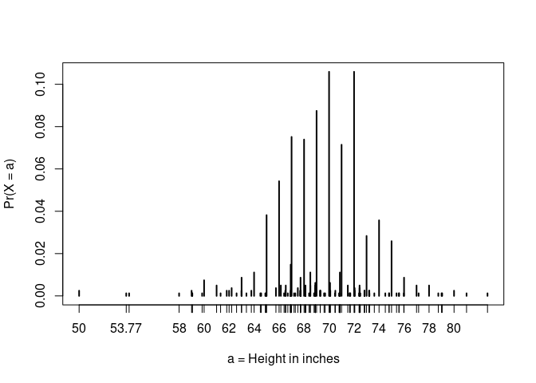
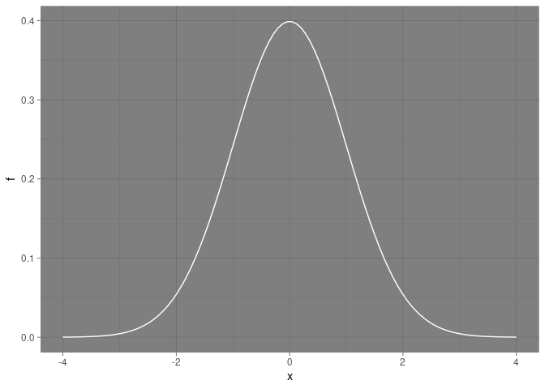
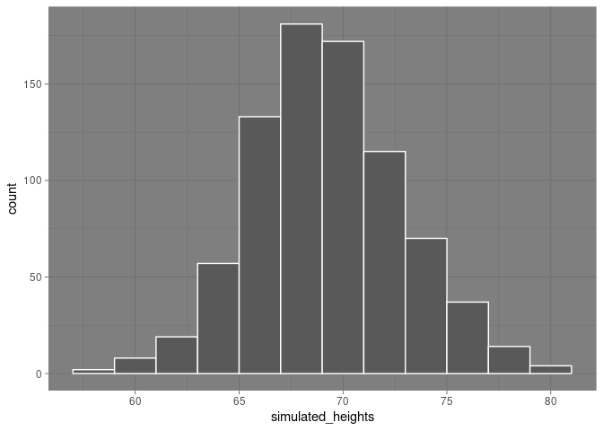

Continuous\_Probability
================
Umberto Fasci

## Continuous Probability

Here, the vector x is characterized as male heights in the height
dataset:

``` r
library(tidyverse)
```

    ## ── Attaching packages ─────────────────────────────────────── tidyverse 1.3.0 ──

    ## ✓ ggplot2 3.3.3     ✓ purrr   0.3.4
    ## ✓ tibble  3.1.0     ✓ dplyr   1.0.5
    ## ✓ tidyr   1.1.3     ✓ stringr 1.4.0
    ## ✓ readr   1.4.0     ✓ forcats 0.5.1

    ## ── Conflicts ────────────────────────────────────────── tidyverse_conflicts() ──
    ## x dplyr::filter() masks stats::filter()
    ## x dplyr::lag()    masks stats::lag()

``` r
library(dslabs)
data(heights)
x <- heights %>% filter(sex == "Male") %>% .$height
```

Defining the empirical distribution function:

``` r
F <- function(a) mean(x<=a)
```

### eCDF approach

If one of the male students in this dataset is chosen, what is the
chance that he is taller than 70.5 inches?

Using eCDF we can simply answer this:

``` r
1 - F(70.5)
```

    ## [1] 0.3633005

Using this cumulative probability function we can compute the
probability of any subset within the data.

### Example

What is the probability of a student being between 65 and 70 in?:

``` r
F(70) - F(65)
```

    ## [1] 0.5172414

### Notes

The cumulative distribution function (CDF) is a distribution function
for continuous data (x) that reports the proportion of the data below
*a* for all values of *a*:

*F*(*a*) = *P**r*(*x* ≤ *a*)

The CDF is the probability distribution function for continuous
variables. For example, to determine the probability that a male student
is taller than 70.5 inches given a vector of male heights *x*, we can
use the CDF:

*P**r*(*x* &gt; 70.5) = 1 − *P**r*(*x* ≤ 70.5) = 1 − *F*(70.5)

Furthermore, the probability that an observation is in between two
values *a*, and *b*:

*F*(*b*) − *F*(*a*)

## Theoretical Distribution

The cumulative distribution for the normal distribution is defined in
base R, and can be obtained with the function `pnorm()`.

`pnorm(a, avg, s)` gives the value of the cumulative distribution
function *F*(*a*) for the normal distribution defined by average *avg*
and standard deviation *s*.

This is quite useful as we wont require the entire data set to determine
the probability of distribution for continuous variables. All that is
required in this are *avg*, and *s*.

Using the normal distribution what is the probability that a randomly
selected student is taller than 70.5 inches:

``` r
1 - pnorm(70.5, mean(x), sd(x))
```

    ## [1] 0.371369

The proportion of students reporting each unique height:

``` r
plot(prop.table(table(x)), xlab = "a = Height in inches", ylab = "Pr(X = a)")
```

<!-- -->

This is the distribution function for the height data set where each
reported height is defined by the proportion of students reporting it.

### Notes

If we treat the height data as discrete rather than categorical, we will
notice that the data are not very useful because interger values are
more common than expected due to rounding. This is called
*discretization*.

## Probability Density

For categorical data, one can define the probability of a category.
Example: a roll of a die (X) can be 1, 2, 3, 4, 5, or 6. The probability
of for is defined as follows:

*P**r*(*X* = 4) = 1/6

Meanwhile, the CDF can be defined by adding up the probability:

*F*(4) = *P**r*(*X* ≤ 4) = *P**r*(*X* = 4) + *P**r*(*X* = 3) + *P**r*(*X* = 2) + *P**r*(*X* = 1)

The probability density at x is defined as the function:

*F*(*a*) = *P**r*(*X* ≤ *a*) = ∫<sub> − ∞</sub><sup>*a*</sup>*f*(*x*)*d**x*

### Example

Using the normal approximation to estimate the probability of someone
being taller than 76 inches, we can use the probability density. In R
one could get the probability density for the normal distribution using
the function `dnorm()`.

## Plotting The Probability Density

Using `dnorm()` to plot the density curve for the normal distribution:

``` r
x <- seq(-4, 4, length = 100)
data.frame(x, f = dnorm(x)) %>%
  ggplot(aes(x, f)) +
  geom_line(color = "white") +
  theme_dark()
```

<!-- -->

## Monte Carlo Simulations

This section covers the use of Monte Carlo simulations for normally
distributed variables. R provides a function to generate normally
distributed outcomes: `rnorm()`. This function takes three arguments:
`rnorm(size, avg, sd)`.

### Example

Here is an example of generating data that looks like the reported
heights from before:

``` r
x <- heights %>% filter(sex == "Male") %>% .$height
n <- length(x)
avg <- mean(x)
s <- sd(x)
simulated_heights <- rnorm(n, avg, s)
data.frame(simulated_heights=simulated_heights) %>% ggplot(aes(simulated_heights)) +
  geom_histogram(color = "white", binwidth = 2) +
  theme_dark()
```

<!-- -->

This is one of the most useful functions in R, allowing us to generate
data that mimics naturally occurring events
